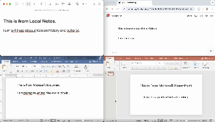

# B-Assist for Mac

B-Assist is a writing assistant designed to enhance your productivity by integrating generative models into your preferred text editor. It offers features like spelling correction and English-to-Korean translation. The application is built with an Electron frontend and a FastAPI backend, ensuring a smooth and seamless user experience.

B-Assist aims to provide an intuitive user experience for writing tasks, making it an excellent tool for writers, students, and professionals who frequently work with text.

## Features

- **Fix Spelling Mistakes**: Automatically corrects spelling errors in your text.
- **Translate English to Korean**: Translates English text into Korean with ease.

### Coming Soon

- **Paraphrase Sentences**: Rewrites sentences to improve clarity and readability.
- **Expand Sentences**: Generates additional content to enhance your writing.
- **Summarize Text**: Condenses lengthy text into a concise summary.
- **Generate Text**: Creates new content based on your input.

## Setup

### Backend

1. Navigate to the backend directory:
    ```bash
    cd ./backend/app
    ```

2. Install the required Python packages:
    ```bash
    pip install --no-cache-dir -r requirements.txt
    CMAKE_ARGS="-DGGML_METAL=on" pip install llama-cpp-python
    ```
    Note: If you are on CUDA/CPU, you can remove the `CMAKE_ARGS="-DGGML_METAL=on"` part and replace it with appropriate CMake args [here](https://llama-cpp-python.readthedocs.io/en/latest/#supported-backends).

3. Start the FastAPI server:
    ```bash
    python api.py
    ```

   The backend will be accessible via the specified port (default: 5000).

### Frontend

1. Navigate to the frontend directory:
    ```bash
    cd ./frontend/src
    ```

2. Install the necessary Node.js packages:
    ```bash
    npm install
    npm postinstall
    ```

3. Start the Electron application:
    ```bash
    npm start
    ```

   The frontend will launch, providing access to the B-Assist features.

### Usage

Press `cmd+shift+X` to open the B-Assist window on any text-editor of our choice. You can then select "Fix Spelling Mistakes" or "Translate English to Korean" to use the respective features and replace the selcted texts.

## Demo B-Assist Usage



## Deployment

### Docker Support

Docker support is coming soon! Stay tuned for updates on containerized deployment.

## Acknowledgements

- [llama-assistant by Vaibhavs10](https://github.com/Vaibhavs10/llama-assistant)
- [ai-typing-assistant by patrickloeber](https://github.com/patrickloeber/ai-typing-assistant)
- [llama-cpp-python by abetlen](https://github.com/abetlen/llama-cpp-python)

## Contributing

If you would like to contribute to B-Assist, please submit a pull request or open an issue on GitHub. Your feedback and contributions are greatly appreciated!
