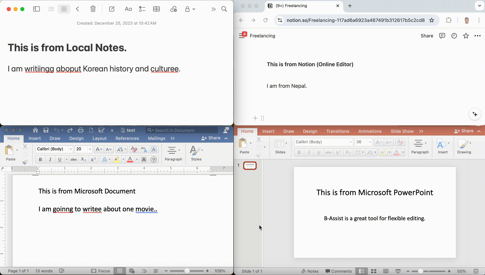

# B-Assist for Mac/Windows

`B-Assist` is a `Better-Assistant` designed to provide a new writing experience by integrating generative models into your preferred text editor. It offers writing features like fixing grammars/spellings and English-to-Korean translation. The application opens a doorway for normal people to easily ride on this emerging world of GenAI.

Ideal for writers, students, and professionals, B-Assist provides an intuitive and seamless user experience for various writing tasks.


## Features

- **Fix Grammar Mistakes**: Automatically corrects grammar errors in your text.
- **Translate English to Korean**: Translates English text into Korean with ease.

### Coming Soon

- **Paraphrase Sentences**: Rewrites sentences to improve clarity and readability.
- **Expand Sentences**: Generates additional content to enhance your writing.
- **Summarize Text**: Condenses lengthy text into a concise summary.
- **Generate Text**: Creates new content based on your input.

## Setup

### BUILD

1. Install the necessary Node.js packages:
    ```bash
    npm install
    ```

2. Start the Electron application:
    ```bash
    npm start
    ```

    This will launch the application, giving you access to all the B-Assist features.


### Usage

To use B-Assist within any text editor, press `cmd+shift+X` (Mac) or `ctrl+shift+X` (Windows). The B-Assist window will open, allowing you to select features like "Fix Grammar and Spelling" or "Translate English to Korean" to process and replace selected text.

## Demo B-Assist Usage



## Deployment

### Creating a Package/Release
1. Run `npm run package` to package the app. The packaged app will be available in the `out` directory.
3. Run `npm run publish` to publish the app to the GitHub repository. This will create a new release with the packaged app.


## Acknowledgements
- [chatd by BruceMacD](https://github.com/BruceMacD/chatd)
- [ai-typing-assistant by patrickloeber](https://github.com/patrickloeber/ai-typing-assistant)

## Contributing

If you would like to contribute to B-Assist, please submit a pull request or open an issue on GitHub. Your feedback and contributions are greatly appreciated!


## Dev Notes
Tested with node version 'v20.16.0' and npm version '10.8.1'
